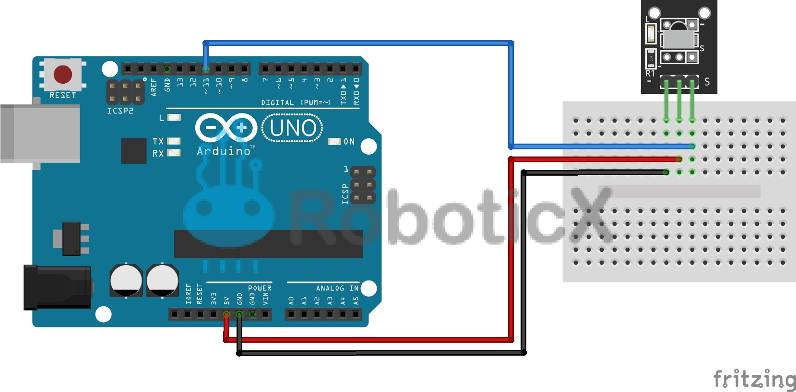

## Instructions
1. Go to chrome://flags and enable "Experimental Web Platform Features"
2. Open [markskinner92.github.io/scoreBoard](markskinner92.github.io/scoreBoard) with Chrome 80 or later
3. Click the gear icon in the middle of the screen.
4. (Without Arduino) Click "link" on the desired actions. you can then press a key on your keyboard to link. Press enter or click OK to save changes. All changes are saved with cookies.
5. (With Arduino) wire an IR reciever to pin 11:

Then upload [this](https://github.com/MarkSkinner92/scoreBoard/blob/main/IRreciever/IRreciever.ino) sketch to your Arduino. (You will need the IRremote library from Elegoo)

Plug it into your computer and click "Connect to USB device" on the website. Select your Arduino from the dropdown that appears.

When it is paired, click "Link" on your desired action, grab an IR remote from somewhere in your house and press a button. The action will link to that button. Hit OK or enter to save and return.
